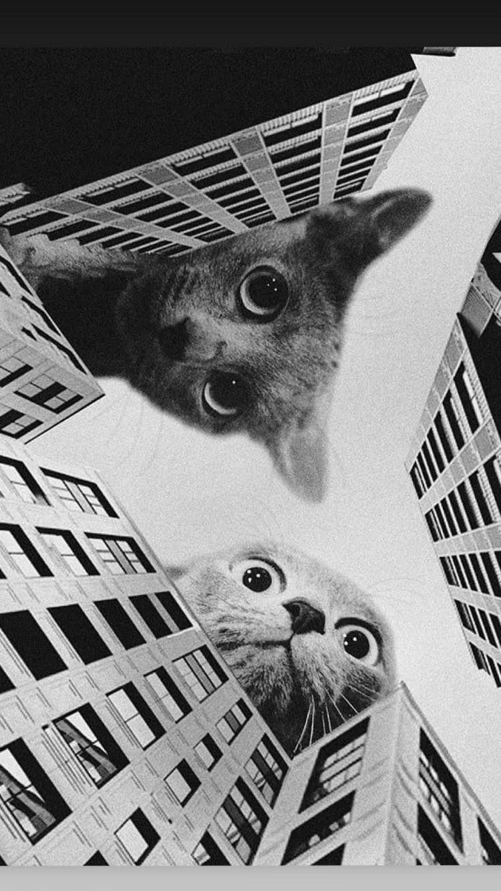

<!-- Banner -->

  

 

<!-- Botões / Links -->

  &nbsp;
  &nbsp;
  &nbsp;
  

 

> ## Hey there! I'm June 👋

<!-- Intro com a arte do cachorro no lugar do planeta -->
<table>
  <tr>
    <td width="62%" valign="top">

**Developer & Software Engineer**

Sou apaixonada por criar aplicações web minimalistas, performáticas e por
construir fluxos de trabalho automatizados e eficientes.

Atualmente foco minha energia em desenvolvimento full-stack com **Java** e
**Angular**, além de explorar **React** e desenvolvimento mobile. Meu playground
técnico gira em torno de interfaces limpas, APIs bem estruturadas e código que
se explica sozinho.

Sempre em busca da próxima estrela para perseguir. ⭐

  </td>
  <td width="38%" valign="middle" align="center">
    
  </td>
  </tr>
</table>

 